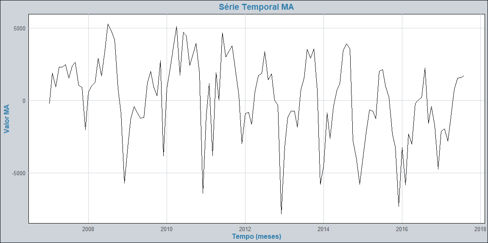
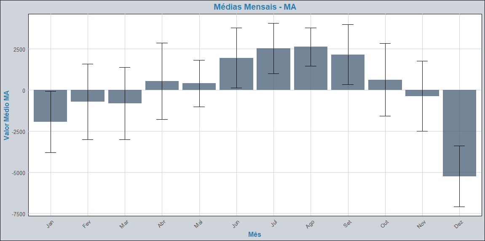
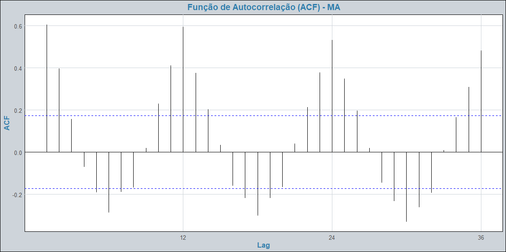
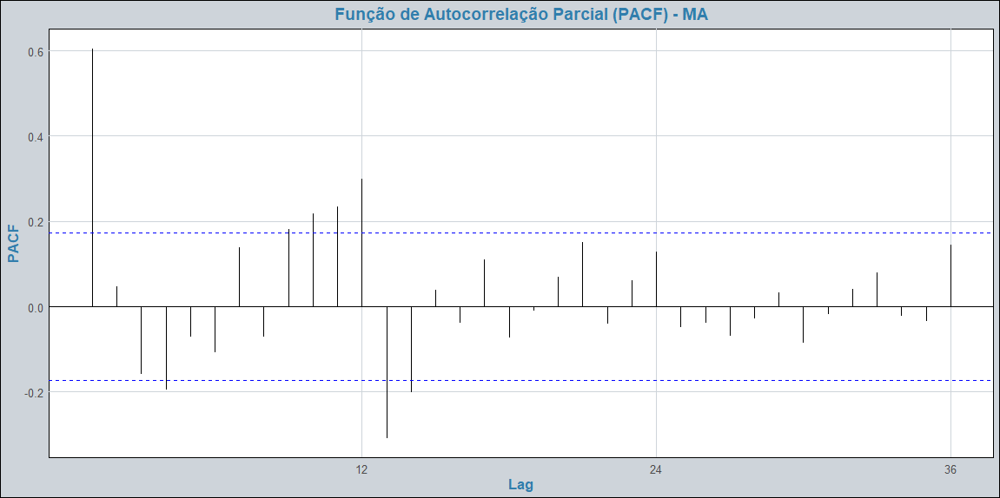
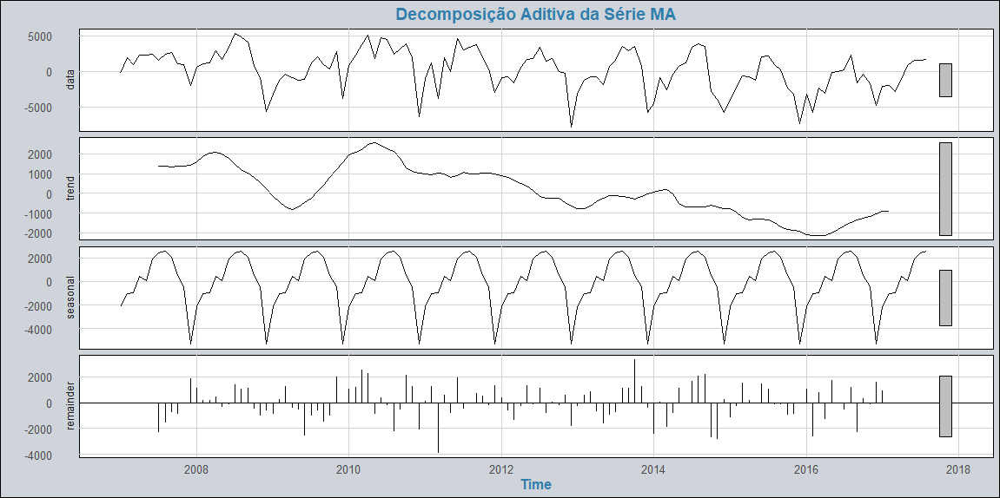
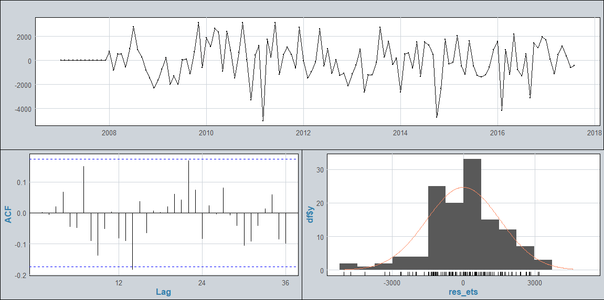
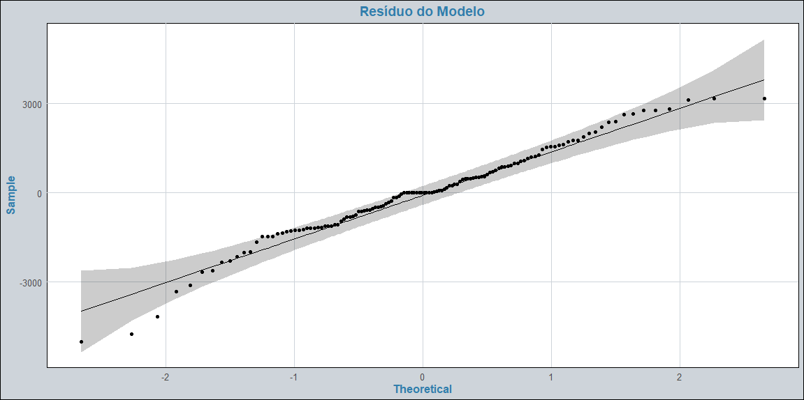
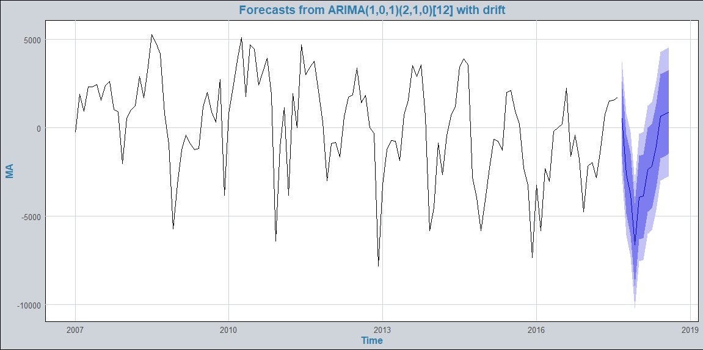

# Análise do Saldo de Emprego do Maranhão (2007–2017)

# 1. Introdução
Este relatório tem como objetivo analisar uma série temporal por meio de uma abordagem estatística completa. Inicialmente, será realizada uma análise descritiva das principais características de cada conjunto de dados. Em seguida, serão ajustados modelos apropriados para a série, com posterior validação dos ajustes realizados. Por fim, será apresentada a etapa de previsão, considerando tanto o horizonte dentro da amostra quanto extrapolações fora da amostra.

A série diz respeito ao saldo de emprego no estado do Maranhão, com dados mensais que refletem a diferença entre admissões e desligamentos formais no mercado de trabalho local. A série cobre o período de janeiro de 2007 a agosto de 2017, contabilizando 128 observações mensais.

Com base em toda a análise estatística de séries temporais que você realizou (volatilidade, ciclos, decomposição, testes de raiz unitária e ajuste do modelo $\text{SARIMA}$), é possível estruturar os objetivos de forma clara e abrangente para o seu trabalho.

---

# 2. Objetivos

## Objetivo Geral

Analisar e modelar a série temporal do saldo de emprego no estado do Maranhão ($\text{MA}$) no período de $\text{2008}$ a $\text{2018}$, identificando seus padrões estruturais (tendência e sazonalidade) e construindo um modelo $\text{SARIMA}$ preditivo para fundamentar futuras projeções de mercado de trabalho.
Com base na sua análise completa de séries temporais, aqui está o resumo dos Objetivos Gerais e Específicos do seu trabalho, em 5 pontos, conforme solicitado:

## Objetivos Específicos

1.  Análise Exploratória e Contextualização: Conduzir a análise exploratória da série, quantificando sua volatilidade e contextualizando o impacto de grandes eventos macroeconômicos (crises de $\text{2008/2009}$ e $\text{2015/2016}$) nas flutuações do saldo de emprego.
2.  Decomposição e Identificação de Padrões: Realizar a decomposição aditiva da série para isolar e caracterizar as componentes de tendência e sazonalidade, identificando os meses de pico (como Junho a Agosto) e de baixa atividade (como Dezembro).
3.  Diagnóstico Estatístico da Série: Aplicar testes de raiz unitária ($\text{ADF}$, $\text{KPSS}$) e testes de tendência ($\text{Mann-Kendall}$, $\text{Cox-Stuart}$) para verificar a estacionariedade e a presença de tendência determinística, preparando a série para a modelagem $\text{SARIMA}$.
4.  Modelagem e Estimação dos Parâmetros: Ajustar o modelo $\text{SARIMA}$ que melhor se adapte à estrutura da série, estimando os parâmetros autorregressivos ($\text{AR}/\text{SAR}$), de médias móveis ($\text{MA}/\text{SMA}$) e os termos de diferença sazonal ($\text{D}$).
5.  Validação e Projeção: Realizar o diagnóstico dos resíduos do modelo ajustado (via Teste de $\text{Ljung-Box}$ e $\text{QQ-Plot}$) para confirmar a característica de Ruído Branco, e utilizar o modelo validado para gerar previsões futuras do saldo de emprego.

---

# 3. Análise Exploratória e Descritiva

### 3.1 Estatísticas Descritivas

A tabela a seguir resume as principais estatísticas descritivas da série temporal:

| Estatística                   | Valor     |
| ----------------------------- | --------- |
| Número de observações (n)     | 128       |
| Média                         | 173.0000  |
| Desvio padrão                 | 2800.1020 |
| Mediana                       | 674.5000  |
| Desvio absoluto mediano (MAD) | 2575.2760 |
| Valor mínimo                  | -7827     |
| Valor máximo                  | 5300      |
| Amplitude                     | 13127     |
| Curtose                       | -0.0759   |

Os resultados indicam uma série temporal com alta volatilidade e comportamento assimétrico. A grande diferença entre a média (173) e a mediana (674,5), aliada à amplitude extrema de 13.127 unidades, revela a presença de valores atípicos e variações bruscas nos dados. O desvio padrão elevado (2.800,1) confirma essa instabilidade. A curtose próxima de zero (-0,0759) sugere uma distribuição mais achatada que a normal, com caudas pesadas. Essas características apontam para a necessidade de modelos robustos que incorporem diferenciação para tratar a não-estacionariedade e componentes sazonais para capturar os padrões cíclicos evidentes na série. A presença de assimetria negativa indica meses com perdas extremas de emprego, que devem ser consideradas separadamente na modelagem.

---

### 3.2 Evolução Temporal e Choques Macroeconômicos

Com base nas características destacadas sobre a evolução mensal do saldo de emprego no estado do Maranhão entre 2008 e 2018, o comportamento do emprego da Figura 1 pode ser interpretado da seguinte forma:

O saldo de emprego no Maranhão nesse período demonstrou uma volatilidade acentuada, caracterizada por amplas flutuações que oscilaram drasticamente
entre valores extremos, variando de $-5.000$ a $\text{5.000}$ novas vagas (saldo). Essa alta variabilidade foi confirmada pelas estatísticas descritivas,
com um Desvio Padrão ($\text{DP}$) significativo de $\text{2.800,1}$, indicando que os dados se dispersam muito em torno da média.

A série temporal é marcada por eventos atípicos que correspondem a grandes choques macroeconômicos:

1.  Houve uma queda abrupta no saldo de emprego, associada diretamente à Crise Financeira Global de 2008/2009.
2.  Posteriormente, o estado vivenciou uma Recuperação progressiva no período de 2011 a 2013, sinalizando um retorno ao crescimento pós-crise.
3.  Contudo, o saldo sofreu uma nova queda acentuada durante a Crise e Recessão Brasileira de 2015-2016.

Observa-se um padrão cíclico no saldo de emprego, com ciclos de $\text{3}$ a $\text{4}$ anos de duração, os quais estão fortemente relacionados ao cenário
macroeconômico nacional e internacional. Essa influência de fatores externos (conjuntura) é mais evidente do que qualquer padrão de sazonalidade interna.

---

### 3.3 Padrão Sazonal

Com base na análise das médias mensais apresentada na Figura 2, o desempenho, atividade ou receita (dependendo da variável analisada) do Maranhão no período de
2008 a 2018 apresenta um padrão sazonal bem definido. Os meses de **Junho, Julho e Agosto** se destacam por apresentar os **maiores valores médios**,
indicando um pico de atividade no meio do ano. Essa concentração sugere o período de melhor desempenho para a variável medida.

Por outro lado, o final e o início do ano são marcados por resultados negativos: **Janeiro, Fevereiro, Março e Dezembro** mostram valores **negativos**.
Entre eles, **Dezembro** é o mês com o **pior desempenho**, registrando a média mais baixa e, notavelmente, uma grande variabilidade nos resultados, sugerindo
que o final do ano é um período de alto risco e baixa atividade/receita.

Já os **meses intermediários**, que incluem **Abril, Maio, Outubro e Novembro**, exibem um comportamento mais estável.
Nesses meses, os valores médios estão mais próximos de zero e, em geral, demonstram uma **menor variação** em comparação com os meses de pico ou de baixa acentuada.

---

### 3.4 Funções de Autocorrelação ($\text{FAC}$ e $\text{FACP}$)

A Função de Autocorrelação (FAC) (Figura 3), há autocorrelação significativa positiva em defasagens múltiplas de 12 (ex: 12, 24, 36), o que sugere sazonalidade anual na série.
A autocorrelação também é significativa em defasagens mais curtas (ex: 1 a 6), indicando dependência temporal de curto prazo. Ainda, os valores que
ultrapassam as linhas azuis (limites de significância) indicam que a autocorrelação nessas defasagens não é resultado do acaso. Após certas defasagens
(entre 7 e 11, por exemplo), a autocorrelação torna-se negativa, o que pode indicar ciclos alternados ou padrões de compensação.

Com base na análise da Função de Autocorrelação Parcial (FACP) (Figura 4), o comportamento da série temporal é o seguinte:

O primeiro lag (defasagem) apresenta um valor de autocorrelação parcial alto (acima de $\text{0,6}$), o que indica uma forte relação direta entre o valor atual e
o valor imediatamente anterior. Em termos práticos, o saldo de emprego de um mês é altamente influenciado pelo saldo do mês imediatamente anterior.

Além disso, a análise revela que alguns lags entre 6 e 13 também ultrapassam as linhas azuis (limites de significância estatística).
Isso sugere que essas defasagens ainda exercem um efeito estatisticamente significativo sobre a variável atual, o que pode indicar influências que se
estendem por um período de $\text{6}$ a $\text{13}$ meses.

No entanto, após o lag 13, todos os valores de autocorrelação parcial permanecem dentro dos limites de significância.
Isso indica que não há mais autocorrelação estatisticamente significativa em defasagens mais longas.

---

### 3.5 Decomposição da Série

A decomposição aditiva (Figura 5) da série temporal do saldo de emprego no Maranhão (MA) nos permite entender a dinâmica da variável ao longo do tempo, separando-a em suas componentes estruturais.

1.  **Dados Observados (*Data*):** Esta é a série original, que capta todas as flutuações e variações do saldo de emprego ao longo do período analisado.
2.  **Tendência (*Trend*):** A análise de longo prazo da série revela uma tendência notável de queda que se inicia por volta de $\text{2010}$ e se estende até aproximadamente $\text{2016}$. Isso sugere um enfraquecimento estrutural ou uma pressão negativa contínua no mercado de trabalho do Maranhão durante esses anos.
3.  **Sazonalidade (*Seasonal*):** A série demonstra uma sazonalidade forte e clara, caracterizada por um padrão que se repete anualmente. A presença de ciclos anuais recorrentes** indica influências previsíveis (como datas comemorativas, colheitas, férias, ou orçamentos governamentais) que afetam o saldo de emprego nos mesmos meses a cada ano.
4.  **Resíduo (*Remainder*):** A componente residual, que representa o ruído ou a variação aleatória não explicada pela tendência ou sazonalidade, está concentrada em torno de zero e não apresenta padrão definido**.

Em conclusão, o modelo de decomposição aditiva foi altamente eficaz em capturar as estruturas principais da série. A forte sazonalidade e a clara tendência decrescente nos últimos anos foram bem isoladas, deixando apenas o ruído aleatório nos resíduos.

---

# 4. Resultados dos Testes Estatísticos 

Esta seção resume os resultados dos principais testes estatísticos aplicados à série temporal, avaliando suas propriedades de autocorrelação, variância, distribuição e estacionariedade.

## 4.1. Teste de Ljung-Box para Autocorrelação

Avalia se os resíduos da série temporal apresentam autocorrelação significativa.

| Teste | Estatística ($X^2$) | Graus de Liberdade ($df$) | Valor-p |
| :--- | :--- | :--- | :--- |
| Box-Ljung | $\text{48.027}$ | $\text{1}$ | $\text{4.204e-12}$ |

**Interpretação:**
Como o $\mathbf{p\text{-valor}}$ é **muito pequeno** ($\text{4.204e-12}$, menor que $\text{0.05}$), a hipótese nula de ausência de autocorrelação é **rejeitada**. Isso confirma que a série temporal **apresenta autocorrelação significativa** e, portanto, **não pode ser considerada ruído branco** (aleatória).

## 4.2. Teste de Heterocedasticidade de White (Breusch-Pagan)

Avalia se a variância dos resíduos é constante ao longo do tempo (homocedasticidade).

| Teste | Estatística ($\text{BP}$) | Graus de Liberdade ($df$) | Valor-p |
| :--- | :--- | :--- | :--- |
| Breusch-Pagan | $\text{0.37863}$ | $\text{1}$ | $\text{0.5383}$ |

**Interpretação:**
O $\mathbf{p\text{-valor}}$ ($\text{0.5383}$) é **maior que $\text{0.05}$**. Consequentemente, **não rejeitamos a hipótese nula** de homocedasticidade. Não há evidência estatística de heterocedasticidade, o que sugere que a **variância dos erros pode ser considerada constante** ao longo do tempo.

## 4.3. Teste de Normalidade (Anderson-Darling)

Verifica se os resíduos da série seguem uma distribuição normal.

| Teste | Estatística ($\text{A}$) | Valor-p |
| :--- | :--- | :--- |
| Anderson-Darling | $\text{0.85767}$ | $\text{0.02683}$ |

**Interpretação:**
Como o $\mathbf{p\text{-valor}}$ ($\text{0.02683}$) é **menor que $\text{0.05}$**, a hipótese nula de normalidade é **rejeitada**. Conclui-se que a **série não segue uma distribuição normal**.

## 4.4 Testes de Tendência Determinística

Avaliam a presença de uma tendência determinística na série temporal.

| Teste | Hipótese Nula ($\text{H0}$) | Valor-p | Conclusão |
| :--- | :--- | :--- | :--- |
| Cox Stuart | Não tendência | $\text{0.0328}$ | **Tendência** |
| Cox and Stuart Trend | Não tendência | $\text{0.0004}$ | **Tendência** |
| Mann-Kendall Trend | Não tendência | $\text{0.0001}$ | **Tendência** |
| Mann-Kendall | Não tendência | $\text{0.0001}$ | **Tendência** |
| KPSS Test for Trend | Não tendência | $\text{0.100}$ | Não Tendência |

**Interpretação:**
A **maioria dos testes** (Cox-Stuart e Mann-Kendall) aponta para a **presença de tendência** na série temporal (p-valor $< \text{0.05}$). A conclusão consolidada é que a **série possui tendência determinística**.

## 4.5. Testes de Raiz Unitária (Estacionariedade)

Verificam se a série é estacionária. (Estacionariedade é essencial para a modelagem $\text{ARIMA}$).

| Teste | Hipótese Nula ($\text{H0}$) | Valor-p | Conclusão |
| :--- | :--- | :--- | :--- |
| Augmented Dickey-Fuller ($\text{ADF}$) | **Não estacionária** (Raiz Unitária) | $\text{0.0100}$ | Não Raiz Unitária |
| Phillips-Perron ($\text{PP}$) | **Não estacionária** (Raiz Unitária) | $\text{0.0100}$ | Não Raiz Unitária |
| KPSS Test for Level | Estacionária (Sem Raiz Unitária) | $\text{0.0187}$ | Não Estacionária |

**Interpretação:**
Há uma **contradição** comum nos resultados:
* $\mathbf{ADF}$ e $\mathbf{PP}$ **rejeitam** a hipótese nula, sugerindo que a série **pode ser estacionária**.
* $\mathbf{KPSS}$ **rejeita** a hipótese nula, indicando **não estacionariedade**.
Juntos, esses resultados sugerem que a série **não é estacionária em nível**, mas provavelmente requer diferenciação para se tornar estacionária.

## 4.6. Testes de Sazonalidade

Avaliam a presença de padrões sazonais que se repetem anualmente.

| Teste | Hipótese Nula ($\text{H0}$) | Valor-p | Conclusão |
| :--- | :--- | :--- | :--- |
| Kruskal-Wallis | Não sazonal | $\text{0}$ | **Sazonal** |
| Friedman rank | Não sazonal | $\text{0}$ | **Sazonal** |

**Interpretação:**
Ambos os testes **rejeitam** a hipótese nula com p-valores iguais a zero. Isso confirma a presença de **sazonalidade altamente significativa** na série temporal.

Com certeza! Vou consolidar todas as informações sobre a Modelagem de Séries Temporais e o ajuste do seu modelo $\text{SARIMA}$ em um texto coeso e em formato $\text{README}$.

---

# 5. Modelagem SARIMA

## 5.1 Fundamentação Teórica dos Modelos

A análise da série temporal do saldo de emprego baseia-se na família de modelos $\text{ARMA}$ (AutoRegressive Moving Average),
que são projetados para prever valores futuros com base em valores passados e erros de previsão passados.
Para séries estacionárias, utiliza-se o modelo **$\text{ARMA}$**. Quando a série não é estacionária, incorpora-se a diferenciação no modelo,
resultando no **$\text{ARIMA}$** (AutoRegressive Integrated Moving Average). Como a série em questão demonstrou sazonalidade significativa
(padrões que se repetem anualmente), o modelo mais adequado é o **$\text{SARIMA}$** (Seasonal $\text{ARIMA}$), que adiciona componentes cíclicos
e diferenciação sazonal à estrutura $\text{ARIMA}$.

Para a estimação e ajuste dos parâmetros do modelo, foi utilizada a função $\texttt{auto.arima()}$ da biblioteca $\texttt{forecast}$ no $\text{R}$.
Esta função emprega o robusto algoritmo de Hyndman e Khandakar ($\text{2008}$), que combina testes de raízes unitárias, o procedimento
*stepwise* e a minimização do Critério de Informação de Akaike ($\text{AIC}$) para selecionar automaticamente o melhor ajuste.

O modelo ajustado é notado pela notação $\text{ARIMA}(p,d,q)(P,D,Q)[m]$, onde os parâmetros são:

* $\mathbf{p}$ (AR) e $\mathbf{q}$ (MA): Número de parâmetros autorregressivos e de médias móveis (componentes não sazonais).
* $\mathbf{d}$: Ordem de integração (diferenciação não sazonal) necessária para estacionarizar a série.
* $\mathbf{P}$ ($\text{SAR}$) e $\mathbf{Q}$ ($\text{SMA}$): Número de parâmetros autorregressivos e de médias móveis sazonais.
* $\mathbf{D}$: Ordem de integração sazonal.
* $[\mathbf{m}]$: Ordem sazonal (neste caso, $\text{12}$ meses).

---

## 5.2 Parâmetros Estimados

O ajuste automático resultou no seguinte conjunto de estimativas para o modelo:

| Parâmetro | Estimativa | Erro Padrão |
| :--- | :--- | :--- |
| $\text{AR}(\text{1})$ | $\text{0.7076}$ | $\text{0.1315}$ |
| $\text{MA}(\text{1})$ | $\text{-0.3409}$ | $\text{0.1734}$ |
| $\text{SAR}(\text{1})$ | $\text{-0.7236}$ | $\text{0.0875}$ |
| $\text{SAR}(\text{2})$ | $\text{-0.4268}$ | $\text{0.0862}$ |
| $\text{Drift}$ | $\text{-24.3796}$ | $\text{13.9307}$ |

O modelo ajustado automaticamente considerou $\mathbf{1}$ parâmetro autorregressivo ($\mathbf{p}=\mathbf{1}$), $\mathbf{1}$ parâmetro de médias móveis ($\mathbf{q}=\mathbf{1}$), $\mathbf{2}$ parâmetros sazonais autorregressivos ($\mathbf{P}=\mathbf{2}$) e $\mathbf{1}$ **diferença sazonal** de ordem $\mathbf{12}$ (o que implica $\mathbf{D}=\mathbf{1}$).

O termo **Drift** (Tendência Determinística) estimado como $\mathbf{-24.3796}$ reforça a conclusão dos testes de tendência, indicando que, em média, há uma **pequena mas constante perda de saldo de emprego** a cada período, mesmo após a modelagem da autocorrelação e sazonalidade.

Na Figura 6, os resíduos gerados pelo modelo apresentaram caracteristicas de ruído branco.

---

# 6. Diagnóstico e Validação do Modelo

Após o ajuste do modelo $\text{SARIMA}$, a análise dos resíduos é fundamental para garantir que o modelo capturou toda a estrutura sistemática da série temporal.
Os testes a seguir confirmam a adequação do modelo.

## 6.1. Teste de Independência (Ljung-Box para Resíduos)

Este teste avalia se os resíduos do modelo são não autocorrelacionados.

| Teste | Estatística | Valor-p | Método |
| :--- | :--- | :--- | :--- |
| Box-Ljung ($\text{lag}=\text{15}$) | $\text{15.9946}$ | $\text{0.3824}$ | Box-Ljung test |

* **Hipótese Nula ($\text{H0}$):** Os resíduos são não autocorrelacionados (são Ruído Branco).
* **Conclusão:** O $\mathbf{p\text{-valor}}$ ($\text{0.3824}$) é **maior que $\text{0.05}$**, portanto, **não rejeitamos a hipótese nula** ($\text{H0}$).

**Resultado:** Tanto os gráficos de $\text{ACF}$ e $\text{PACF}$ (mencionados implicitamente) quanto o Teste de Ljung-Box confirmam a **independência dos resíduos**.
Isso indica um bom ajuste do modelo, pois o que sobrou são apenas erros aleatórios.

## 6.2. Teste de Normalidade (Anderson-Darling)

Avalia se os resíduos do modelo seguem uma distribuição normal, o que é uma premissa para a inferência estatística dos parâmetros do modelo.

| Teste | Estatística | Valor-p | Método |
| :--- | :--- | :--- | :--- |
| Anderson-Darling | $\text{0.6297}$ | $\text{0.0987}$ | Anderson-Darling normality test |

* **Hipótese Nula ($\text{H0}$):** Os resíduos seguem uma distribuição normal.
* **Conclusão:** O $\mathbf{p\text{-valor}}$ ($\text{0.0987}$) é **maior que $\text{0.05}$**, portanto, **não rejeitamos a hipótese nula** ($\text{H0}$).

**Resultado:** Os resíduos do modelo $\text{SARIMA}$ podem ser considerados aproximadamente normais. Este achado reforça a adequação do modelo ajustado e permite a construção de intervalos de confiança confiáveis.

Esta conclusão é reforçada pelo Gráfico $\text{QQ-Plot}$. Na Figura 7, que compara os quantis dos resíduos (Sample)
com os quantis de uma distribuição normal teórica (Theoretical), a maioria dos pontos plotados se encontra muito próxima da linha diagonal central.
Embora haja um leve afastamento nas caudas (valores extremos), indicando que a distribuição pode ter caudas ligeiramente mais pesadas, a aderência geral
à reta central demonstra que a premissa de normalidade para a construção de intervalos de confiança é razoavelmente atendida pelo modelo ajustado.

## 6.3. Teste da Raiz Unitária (Estacionariedade dos Resíduos)

Verifica se os resíduos são estacionários, o que é uma forma de confirmar que não há mais tendência ou autocorrelação estrutural remanescente.

| Teste | Hipótese Nula ($\text{H0}$) | Valor-p | Conclusão |
| :--- | :--- | :--- | :--- |
| Augmented Dickey-Fuller ($\text{ADF}$) | Raiz Unitária (Não Estacionária) | $\text{0.01}$ | **NÃO** Raiz Unitária |
| Phillips-Perron ($\text{PP}$) | Raiz Unitária (Não Estacionária) | $\text{0.01}$ | **NÃO** Raiz Unitária |
| $\text{KPSS}$ Test for Level | Não Raiz Unitária (Estacionária) | $\text{0.10}$ | **NÃO** Raiz Unitária |

* **Conclusão:** Os testes $\text{ADF}$ e $\text{PP}$ rejeitam $\text{H0}$ (Raiz Unitária), enquanto o $\text{KPSS}$ (que testa a $\text{H0}$ oposta) não rejeita, quando o p-valor é considerado $\text{0.10}$ como limite para o teste $\text{KPSS}$ no nível $\text{0.05}$.

**Resultado:** Os resíduos não apresentam raiz unitária e, portanto, são estacionários. Isso é mais uma evidência de que a diferenciação e os componentes $\text{ARIMA}$ conseguiram remover a não estacionariedade da série original.

---

# 7. Previsão

Na Figura 8, o modelo prevê que os valores da série continuarão a apresentar sazonalidade, oscilando positivamente e negativamente, como nos anos anteriores.
O centro da previsão está ligeiramente abaixo de zero (provavelmente influenciado pelo drift negativo estimado), mas ainda dentro da faixa de variação histórica.
A amplitude da incerteza aumenta ao longo do tempo, o que é esperado — previsões mais distantes têm menos confiança. Assim, o modelo aparentemente conseguiu
capturar a estrutura da série, já que as previsões seguem o padrão sazonal e a média histórica.

---

# 8. Conclusão

---
