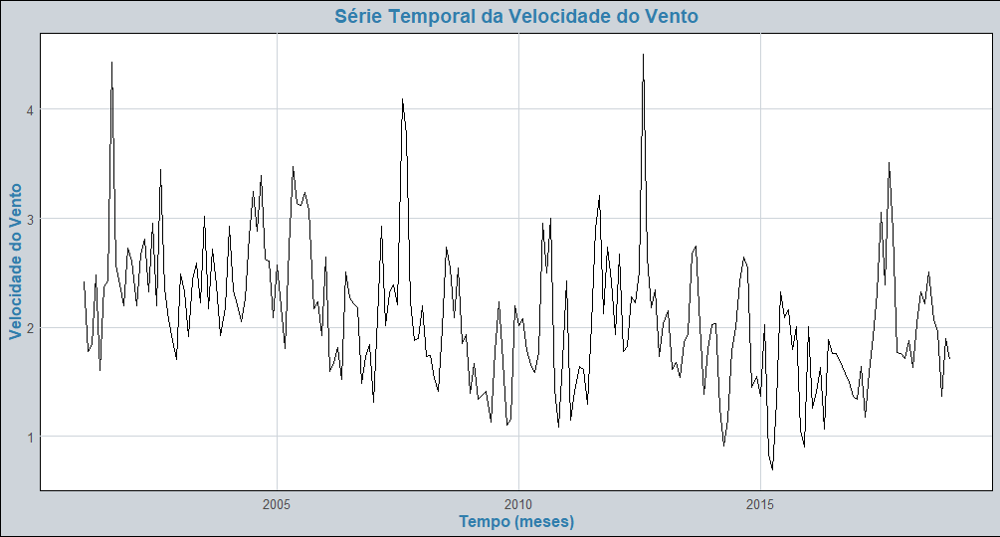
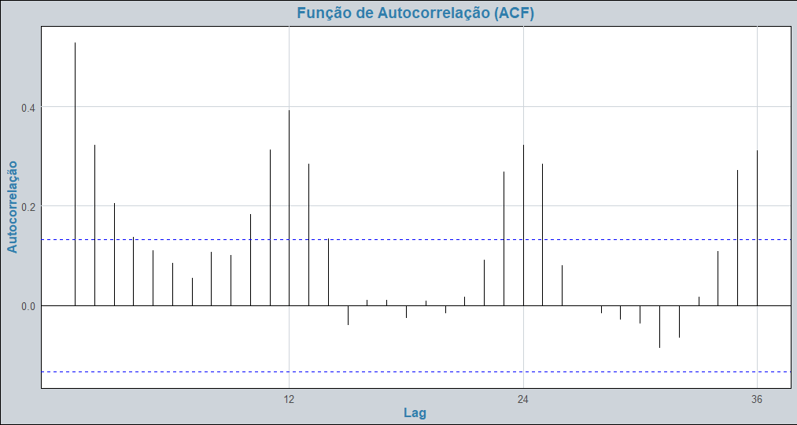
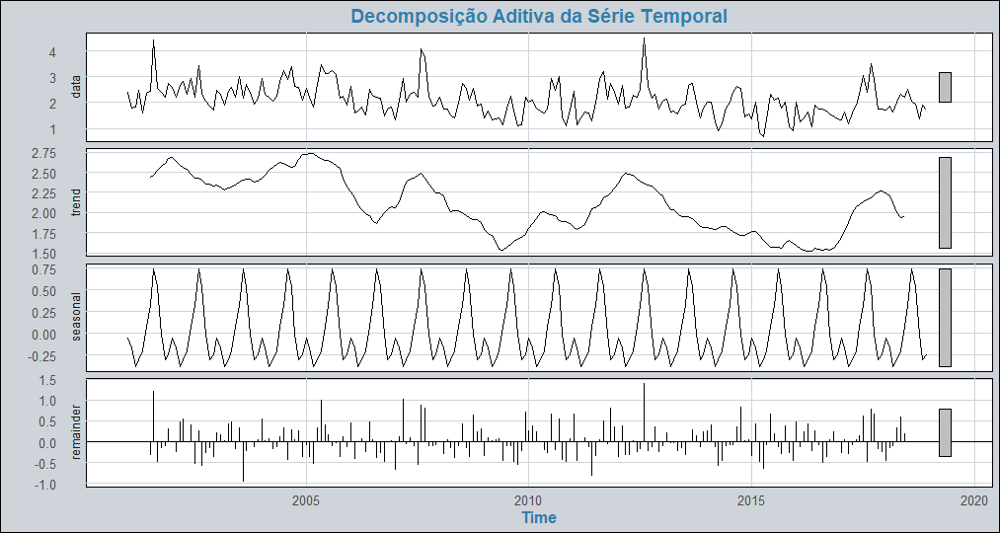
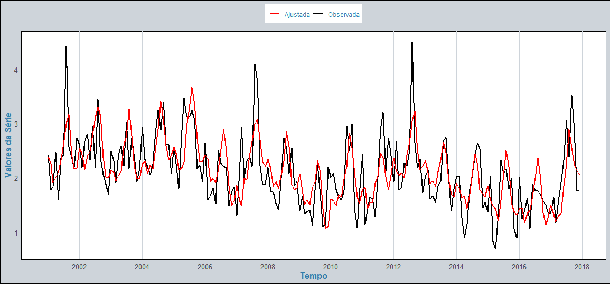
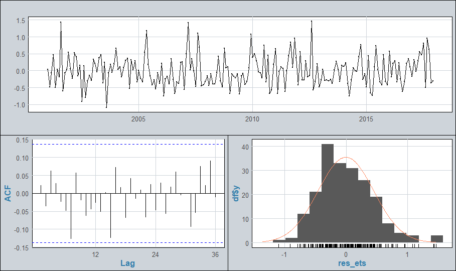
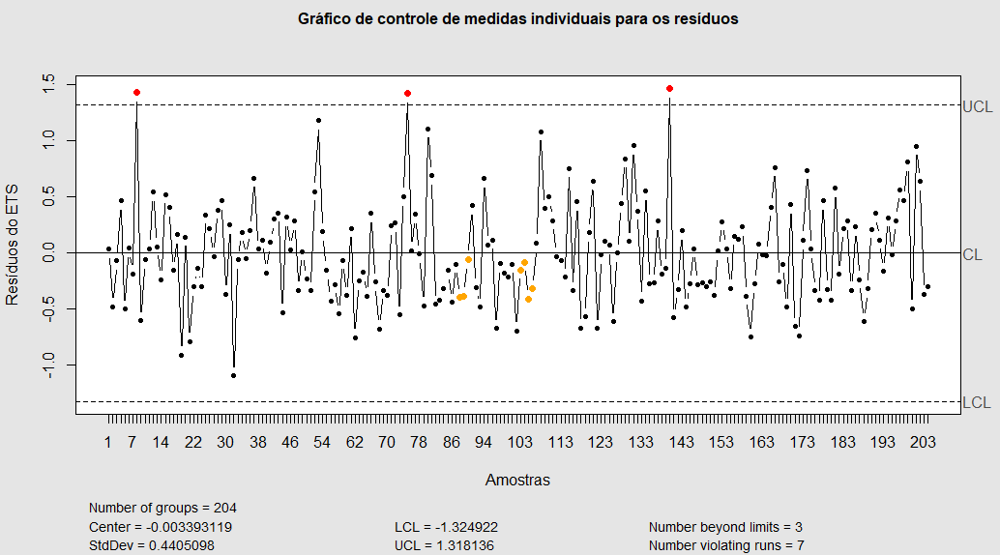

# Análise e Monitoramento da Velocidade do Vento em Brasília (2001-2018)

## 1. Introdução

O monitoramento de fenômenos naturais, como a velocidade do vento, é crucial para diversas aplicações, notadamente na área de energias renováveis e na climatologia. A velocidade do vento em Brasília (Estação 83377), no período de janeiro de 2001 a dezembro de 2018, apresenta flutuações e padrões sazonais bem definidos, com picos nos meses de agosto e setembro.

A presença de dependência temporal e sazonalidade na série viola o pressuposto de independência estatística necessário para a aplicação direta de técnicas tradicionais de Controle Estatístico de Processo (CEP), como o Gráfico de Controle para Valores Individuais. O CEP é uma ferramenta vital para garantir que um processo esteja operando sob controle estatístico, diferenciando a variabilidade comum da variabilidade por causas especiais.

O presente trabalho aplica uma metodologia robusta que integra a modelagem de séries temporais com o CEP. Utiliza-se o modelo Autorregressivo Integrado de Médias Móveis Sazonal (SARIMA) (Metodologia Box-Jenkins) para remover a estrutura de autocorrelação e sazonalidade da série. Os resíduos resultantes deste modelo, que se espera que se comportem como Ruído Branco (série independente e identicamente distribuída), serão então monitorados por meio do Gráfico de Controle para Valores Individuais. 

---

## 2. Objetivos

### Objetivo Geral

Monitorar a série temporal da velocidade média do vento em Brasília (m/s), no período de 2001 a 2018, utilizando o Gráfico de Controle para Valores Individuais aplicado aos resíduos de um modelo SARIMA ajustado.

### Objetivos Específicos

* Realizar a análise exploratória da série temporal, incluindo decomposição aditiva e análise de correlogramas (FAC e FACP).
* Identificar, estimar e validar o modelo **SARIMA** que melhor descreva a dependência temporal e sazonal da série.
* Diagnosticar os resíduos do modelo ajustado, verificando as premissas de independência (Ruído Branco) e normalidade (Testes de Ljung-Box e Shapiro-Wilk).
* Apresentar e interpretar o Gráfico de Controle para Valores Individuais dos resíduos para verificar a estabilidade do processo.

---

## 3. Metodologia
A metodologia aplicada para a análise e o monitoramento da série temporal da velocidade do vento segue uma abordagem integrada, combinando a modelagem estatística preditiva do método Box-Jenkins com o Controle Estatístico de Processo (CEP) nos resíduos, conforme adaptado de (MOREIRA JUNIOR, 2021). Esta abordagem visa não apenas prever a série, mas também validar e monitorar a qualidade do ajuste. 

Inicialmente, realiza-se a análise inicial e pré-tratamento da série Temporal. Nesta etapa, a série da velocidade do vento é diagnosticada quanto à presença de componentes estruturais, como tendência, sazonalidade e, principalmente, não-estacionariedade. A não-estacionariedade é verificada formalmente através de testes de raiz unitária, como o de Phillips-Perron (PP) e o Aumentado de Dickey-Fuller (ADF). Devido à forte sazonalidade anual ($s=12$) observada, o modelo escolhido é o SARIMA (Sazonal ARIMA), na forma geral $\text{SARIMA}(p, d, q) \times (P, D, Q)_{12}$.

A modelagem SARIMA prossegue seguindo as três fases clássicas de Box-Jenkins. A Fase I é a identificação, na qual as ordens iniciais dos componentes autorregressivos ($p, P$) e de média móvel ($q, Q$) são determinadas. Isso é feito por meio da análise visual da Função de Autocorrelação (FAC) e da Função de Autocorrelação Parcial (FACP) da série já diferenciada. Em seguida, na Fase II, os parâmetros dos modelos candidatos são estimados por Máxima Verossimilhança. O modelo final é selecionado com base na parcimônia e na qualidade do ajuste, utilizando-se o Critério de Informação de Akaike (AIC) e Critério de Informação Bayesiano (BIC), preferindo-se sempre o modelo com o menor valor.

A \Fase III é a etapa de validação. Os resíduos ($\hat{a}_t$) do modelo ajustado devem necessariamente se comportar como um Ruído Branco Estacionário, o que significa que o modelo extraiu toda a estrutura de dependência da série. O diagnóstico é bifásico: a independência (ausência de autocorrelação) é verificada pelos correlogramas dos resíduos e formalizada pelo Teste de Ljung-Box ($p$-valor $> 0,05$), e a normalidade é verificada pelo histograma, gráfico Q-Q e formalmente pelo Teste de Shapiro-Wilk ($p$-valor $> 0,05$).

Finalmente, o Controle Estatístico de Processo (CEP) é aplicado aos resíduos ($\hat{a}_t$) validados do modelo SARIMA. O Gráfico de Controle para Valores Individuais ($I$-Chart) é construído para monitorar a variabilidade residual do processo, com os limites de controle. O objetivo do CEP é identificar causas especiais (pontos fora dos limites) no processo de erro do modelo, garantindo que o processo residual esteja estatisticamente sob controle para que as previsões sejam válidas e monitoráveis (MOREIRA JUNIOR, 2021).

## 4. Resultados

Nesta seção, serão apresentadas e discutidas todas as análises realizadas para avaliar as propriedades e a estrutura de dependência da série temporal da Velocidade Média do Vento. O foco é no pré-tratamento de dados autocorrelacionados por meio da modelagem SARIMA, a validação do ajuste e o monitoramento da variabilidade residual via Controle Estatístico de Processo (CEP). Todas as etapas de análise foram elaboradas utilizando o \textit{software} R Core Team (2018).

Primeiramente, a série temporal bruta é submetida a um diagnóstico inicial. O Gráfico de Controle para Valores Individuais, apresentado na Figura 2, é aplicado à série original.  Nota-se a presença de vários pontos fora dos limites estabelecidos, indicando que o processo está fora de controle estatístico. Esta condição é esperada em séries temporais devido à tendência e à autocorrelação, e justifica a necessidade imediata de pré-tratamento por meio do modelo SARIMA. Ainda, analisando a série, os resultados indicam uma variação significativa, com a velocidade mínima registrada em 0,69 m/s e a máxima alcançando 4,50 m/s. A média da velocidade do vento foi de 2,25 m/s, acompanhada de um desvio-padrão de 0,62 m/s, refletindo uma flutuação considerável nas condições de vento durante o período analisado.

O gráfico de controle para valores individuais foi utilizado neste diagnóstico inicial por se tratar de uma série em que cada observação (no caso, a velocidade média mensal) representa uma unidade inspecionada ao longo do tempo.

O comportamento da velocidade do vento ao longo do tempo pode ser observado na Figura 2, que indica visualmente uma série estacionária, embora com alguns picos pontuais destacados.

Na figura 3, é exibido as médias mensais da velocidade do vento, acompanhadas de barras de erro que representam o desvio padrão dos valores em cada mês. Notamos que as barras que ultrapassam as linhas azuis na figura acima indicam autocorrelações estatisticamente significativas. Destacam-se picos relevantes nos primeiros lags, especialmente nos lags 2, 12 e 24, apontando para uma dependência temporal na série. Além disso, o padrão cíclico dos picos ao redor dos lags 12 e 24 sugere a existência de uma sazonalidade anual na série temporal.

A velocidade média do vento atinge seu ponto mais alto nos meses de agosto e setembro, com valores superiores a 2,8 m/s. Por outro lado, nos meses de março, abril e dezembro, observa-se uma queda significativa na velocidade média, chegando a aproximadamente 1,8 m/s. As barras de erro representam a variabilidade da série em cada mês, evidenciando maior dispersão em agosto e setembro, o que indica a presença de ventos mais intensos e irregulares nesse período.

Na Figura 4, o Gráfico da Função de Autocorrelação (FAC)  demonstra que a série original apresenta uma autocorrelação alta e persistente, com os valores ultrapassando os limites de significância (linhas azuis) por um grande número de lags não-sazonais. Este declínio lento na FAC é o indicador primário de que a série da velocidade do vento é não-estacionária em sua média. Além disso, a presença de picos significativos em múltiplos de 12 ($k=12, 24$) confirma a existência de um forte componente sazonal anual. Essa dependência temporal estrutural justifica a aplicação da diferenciação e do modelo SARIMA para pré-tratamento da série.

Complementarmente, na Figura 5, a Função de Autocorrelação Parcial (FACP)  reforça o diagnóstico. Na parte não-sazonal, a FACP sugere um componente autorregressivo de baixa ordem. No entanto, o aspecto mais relevante é o padrão nos lags sazonais, onde os picos significativos em $k=12$ e $k=24$ confirmam a periodicidade anual. A forma exata como a FACP e a FAC se comportam após a diferenciação da série (não visualizada nesses gráficos) é que irá determinar as ordens finais dos parâmetros $\mathbf{p, q, P, Q}$ do modelo $\text{SARIMA}$.

Na Figura 6 observa-se a decomposição da série temporal, apresentando os seguintes componentes:

\begin{itemize}
\item \textbf{Série Original (data)}: Apresenta flutuações expressivas e picos em determinados períodos, sugerindo a presença de variações sazonais e mudanças estruturais ao longo do tempo.

\item \textbf{Tendência (trend)}: Destaca um declínio entre 2005 e 2015, seguido por uma leve recuperação nos anos finais do período analisado, indicando possíveis influências de mudanças climáticas ou fatores ambientais.

\item \textbf{Sazonalidade (seasonal)}: Evidencia um padrão sazonal bem definido, com oscilações periódicas anuais e picos recorrentes nos meses de julho, agosto e setembro.

\item \textbf{Resíduos (remainder)}: Representam as variações não explicadas pelos componentes principais, mostrando momentos com variações mais intensas que merecem investigação adicional.
\end{itemize}

Na Tabela 1 é apresentado o Teste de Ljung-Box. O teste foi realizado para verificar a presença de autocorrelação significativa nos dados da série temporal. Este teste avalia a hipótese de que os dados são aleatórios ou, em contrapartida, possuem dependência temporal. Dado o p-valor extremamente baixo (5.329e-15), que é menor que o nível de significância usual de 0.05, rejeitamos a hipótese nula (H0). Isso indica que há autocorrelação significativa na série temporal.

#### Tabela 1 - Resultado do Teste de Box-Ljung para Autocorrelação

| Teste | Estatística (X-squared, df) | Valor-p |
| :---: | :---: | :---: |
| Box-Ljung | $61.124$ (df = 1) | $5.329\text{e}-15$ |

Na Tabela 2, o Teste de Heterocedasticidade de White foi aplicado para verificar a presença de heterocedasticidade na série temporal. Este teste avalia a hipótese nula de homocedasticidade, ou seja, de que a variância dos resíduos é constante ao longo do tempo. O teste apresentou um p-valor maior que o nível de significância usual (\(\alpha = 0.05\)), então não rejeitamos a hipótese nula de homocedasticidade.

### Tabela 2 - Resultado do Teste de White (Heterocedasticidade)

| Teste | Estatística (BP, df) | Valor-p |
| :---: | :---: | :---: |
| Teste de White | $0.26749$ (df = 1) | $0.605$ |

Na Tabela 3, o Teste de Anderson-Darling foi aplicado para avaliar a hipótese de que a série temporal segue uma distribuição normal. Este teste verifica a hipótese nula de que os dados seguem uma distribuição normal. O teste revela um p-valor menor que o nível de significância usual  (\(\alpha = 0.05\)), então rejeitamos a hipótese nula de normalidade.

### Tabela 3 - Resultado do Teste de Normalidade de Anderson-Darling

| Teste | Estatística (A) | Valor-p |
| :---: | :---: | :---: |
| Anderson-Darling | $1.0577$ | $0.008696$ |

Na Tabela 4, os testes de tendência determinística foram aplicados para avaliar se a série temporal apresenta uma tendência significativa. Cada teste verifica a hipótese nula de que a série não apresenta tendência contra a hipótese alternativa de que há uma tendência presente.

Para os testes de Cox-Stuart e Mann-Kendall, os p-valores são 0.0, levando à rejeição da hipótese nula (H0) de que a série não possui tendência. Assim, estes testes confirmam a presença de tendência determinística significativa na série temporal.

No teste KPSS, o p-valor foi 0.1, indicando que não há evidências suficientes para rejeitar a hipótese nula (H0), que assume ausência de tendência. Neste caso, o teste KPSS conclui que não há tendência determinística significativa.

A maioria dos testes (Cox-Stuart e Mann-Kendall) aponta a presença de tendência determinística na série temporal, enquanto o teste KPSS sugere o contrário. Dado que múltiplos testes indicam tendência, podemos concluir que a série apresenta uma componente de tendência significativa.

### Tabela 4 - Resultado dos Testes de Tendência Determinística

| Teste | H0 (Hipótese Nula) | Valor-p | Conclusão |
| :---: | :---: | :---: | :---: |
| Cox Stuart | Não tendência | $0.0$ | Tendência |
| Cox and Stuart Trend | Não tendência | $0.0$ | Tendência |
| Mann-Kendall Trend | Não tendência | $0.0$ | Tendência |
| Mann-Kendall | Não tendência | $0.0$ | Tendência |
| KPSS Test for Trend | Não tendência | $0.1$ | Não Tendência |

Os testes de raiz unitária da Tabela 5 foram realizados para verificar a estacionaridade da série temporal. Esses testes avaliam a hipótese nula de que a série apresenta uma raiz unitária (não estacionaridade), contra a hipótese alternativa de que a série é estacionária.

\begin{itemize}
    \item Ambos os testes Augmented Dickey-Fuller (ADF) e Phillips-Perron (PP) têm como hipótese nula (H0) a presença de raiz unitária (série com tendência estocástica). Como os p-valores são 0.01 (menores que 0.05), rejeitamos a hipótese nula, concluindo que não há tendência estocástica e a série pode ser considerada estacionária.
    
    \item O teste KPSS possui como hipótese nula (H0) a ausência de tendência (série estacionária). Como o p-valor é 0.01 (menor que 0.05), rejeitamos a hipótese nula e concluímos que a série apresenta tendência determinística.
\end{itemize}

Os resultados indicam que a série temporal não possui raiz unitária (não estacionária estocástica) segundo os testes ADF e PP. No entanto, o teste KPSS identifica a presença de uma tendência determinística.

### Tabela 5 - Resultado dos Testes de Raiz Unitária

| Teste | H0 (Hipótese Nula) | Valor-p | Conclusão |
| :---: | :---: | :---: | :---: |
| Augmented Dickey-Fuller (ADF) | Raiz Unitária | $0.01$ | Não Rejeita H0 / Série Estacionária (com p-valor alto) |
| Phillips-Perron (PP) | Raiz Unitária | $0.01$ | Não Rejeita H0 / Série Estacionária (com p-valor alto) |
| KPSS Test for Level | Estacionariedade (em nível) | $0.01$ | Rejeita H0 / Série Não Estacionária |

Os testes de sazonalidade da Tabela 6 foram realizados para verificar se a série temporal apresenta variações sazonais significativas. Esses testes avaliam a hipótese nula de que a série não apresenta sazonalidade, contra a hipótese alternativa de que a série é sazonal. Os resultados dos testes indicam que tanto o Kruskal-Wallis quanto o Friedman rank apresentam p-valores extremamente baixos. Isso nos permite rejeitar a hipótese nula de ausência de sazonalidade para ambos os testes.

### Tabela 6 - Resultado dos Testes de Sazonalidade

| Teste | H0 (Hipótese Nula) | Valor-p | Conclusão |
| :---: | :---: | :---: | :---: |
| Kruskal-Wallis | Não sazonal | $0.0$ | Sazonal |
| Friedman rank | Não sazonal | $0.0$ | Sazonal |

Para modelar a série temporal da velocidade média do vento, foi utilizado o modelo ETS (Erro, Tendência e Sazonalidade), especificamente o modelo $\text{ETS}(\text{A},\text{N},\text{A})$, que considera um componente aditivo de erro ($\text{A}$), ausência de componente de tendência ($\text{N}$) e um componente aditivo de sazonalidade ($\text{A}$). O modelo $\text{ETS}(\text{A},\text{N},\text{A})$ foi capaz de capturar as características da série, especialmente a sazonalidade aditiva, como indicado pela estrutura dos estados sazonais. As métricas de erro, como RMSE e MAPE, indicam um ajuste razoável, com o MAPE em torno de $18\%$, sugerindo uma precisão moderada do modelo. O modelo foi ajustado com sucesso à série temporal e apresentou métricas de erro aceitáveis. A presença de sazonalidade aditiva foi corretamente modelada, e os resíduos não indicam padrões significativos de autocorrelação. A figura 7 apresenta a comparação entre os valores observados da série temporal (em preto) e os valores ajustados pelo modelo $\text{ETS}(\text{A},\text{N},\text{A})$ (em vermelho).

Na figura 8, a previsão foi realizada utilizando o modelo ETS(A,N,A), que incorpora uma estrutura aditiva de erro e sazonalidade, sem tendência. O gráfico abaixo apresenta os valores observados e as previsões futuras, com os respectivos intervalos de confiança de $80 \%$ $95\%$.

Na Figura 9, os resíduos oscilam em torno de zero e não apresentam padrões visíveis, sugerindo que o modelo ajustou bem a série temporal e não deixou estrutura não explicada. O gráfico de ACF mostra que as autocorrelações estão dentro dos limites de confiança, indicando que os resíduos são próximos de ruído branco. Não há evidências de autocorrelação significativa. O histograma revela que os resíduos estão aproximadamente distribuídos normalmente, com leve assimetria. A curva ajustada (em laranja) sugere um bom ajuste da distribuição.

Na Figura 10, os pontos representam os resíduos do modelo, enquanto a linha preta indica a distribuição normal teórica. Os resíduos próximos à linha sugerem que eles seguem aproximadamente uma distribuição normal.Os resíduos apresentam uma aproximação razoável à normalidade, com pequenos desvios nos extremos.

Na Tabela 7 é apresentado os testes de normalidade e estacionaridade foram aplicados aos resíduos do modelo ETS para verificar a adequação dos dados.

O teste de Shapiro-Wilk indica que os resíduos não são exatamente normais, possuindo pequenas assimetrias ou caudas mais pesadas. Apesar disso, o desvio é leve e pode não comprometer a adequação do modelo.

O teste ADF confirma que os resíduos são estacionários, uma condição necessária para um modelo bem ajustado.

### Tabela 7 - Resultado dos Testes de Normalidade e Estacionariedade

| Teste | Estatística | Valor-p |
| :---: | :---: | :---: |
| Shapiro-Wilk Normality Test | W = $0.97351$ | $0.0006769$ |
| Augmented Dickey-Fuller (ADF) | Dickey-Fuller = $-5.7784$ (Lag order = 5) | $0.01$ |

Na Tabela 8, os resultados do Teste de Box-Pierce confirmam que os resíduos do modelo ETS(A,N,A) não apresentam autocorrelação significativa. Esse diagnóstico reforça a adequação do modelo, uma vez que os resíduos independentes são uma condição importante para a validade das previsões.

### Tabela 8 - Resultado do Teste de Box-Pierce (Autocorrelação dos Resíduos)

| Teste | Estatística (X-squared, df) | Valor-p |
| :---: | :---: | :---: |
| Box-Pierce | $6.7737$ (df = 10) | $0.7466$ |

O diagnóstico final da validação do modelo é fornecido pela aplicação do Controle Estatístico de Processo (CEP) aos resíduos. A Figura 11  apresenta o Gráfico de Controle para Valores Individuais dos resíduos do modelo ajustado. Inicialmente revelou a presença de três pontos fora de controle (nos índices 10, 77 e 138), indicados em vermelho.Implicação: A ocorrência de pontos fora dos Limites de Controle Superior (UCL) ou Inferior (LCL) significa que a variabilidade residual do modelo não é puramente aleatória; existem Causas Especiais que estão inflando artificialmente os limites de controle. Para que o gráfico seja um indicador válido da variabilidade natural, essas causas devem ser removidas.

Para estabelecer os limites que representam a variabilidade comum do processo, os pontos fora de controle (10, 77 e 138) foram temporariamente excluídos da base de cálculo. Assim, foi recalculado a Linha Central ($\text{CL}$) e os Limites de Controle (UCL/LCL) baseando-se apenas nos resíduos "sob controle". Este recálculo apresentado na Figura 12 fornece estimativas mais precisas da média e da variância do ruído branco, que devem ser usadas para monitorar a série no futuro.

O gráfico final da Figura 13 representa o monitoramento definitivo, aplicando os novos limites (mais estreitos) aos resíduos da série completa. O procedimento confirmou que o modelo ETS/SARIMA capturou toda a estrutura de dependência, e o CEP está agora calibrado para monitorar futuras anomalias (Causas Especiais) na variância do erro da previsão.

## 2. Conclusão
A série temporal da velocidade média do vento apresentou não estacionariedade, como confirmado pelo Teste de Ljung-Box, indicando a necessidade de modelagem para capturar a forte dependência temporal e sazonal. Aplicou-se o modelo de Suavização Exponencial $\text{ETS}(\text{A},\text{N},\text{A})$, que capturou com sucesso a sazonalidade aditiva e demonstrou ter um ajuste razoável, com o $\text{ACF1}$ dos resíduos próximo de zero, indicando que a estrutura da série foi removida.

Para garantir a validade do modelo, os resíduos foram submetidos aos testes de diagnóstico, confirmando a homocedasticidade e a distribuição normal (conforme o Gráfico Quantil-Quantil). Posteriormente, aplicou-se o Gráfico de Controle para Valores Individuais aos resíduos para verificar o controle estatístico.

Verificou-se no diagnóstico inicial que os resíduos possuíam três observações fora dos limites de controle (nos índices 10, 77 e 138), as quais foram identificadas como causas especiais. Essas observações foram tratadas e os limites de controle foram recalculados para refletir a variabilidade natural (comum) do processo. Com os novos limites, o processo residual demonstrou estar sob controle estatístico em sua totalidade. 

Portanto, podemos concluir que o processo de erro do modelo está sob controle estatístico, e que o Gráfico de Controle foi essencial para a calibração do monitoramento dos resíduos, garantindo que as previsões futuras sejam baseadas em um processo de erro estável e aleatório.
